# Enterprise Architecture - EatFair Delivery

## 🏗️ Scalable Architecture Overview

To ensure the EatFair application can scale to millions of users and maintain code quality across multiple apps (`app`, `partner`, `orderapp`), we have implemented a **Clean Architecture** with a centralized **Data Layer** in the `:shared` module.

### 🔄 The "Missing Piece" Solved
Previously, the `RestaurantRepo` was isolated in the `:app` module, preventing the Partner and Delivery apps from accessing critical data. We have moved this to `:shared` and enhanced it with Dependency Injection.

### 📦 Module Structure

```mermaid
graph TD
    App[📱 Customer App] --> Shared[📦 Shared Module]
    Partner[🏪 Partner App] --> Shared
    Order[🛵 Delivery App] --> Shared
    
    subgraph Shared Module
        Models[Data Models]
        Repo[Repositories]
        Local[Local Data / Session]
    end
```

## 🚀 Key Components

### 1. Centralized Repositories (`:shared`)
- **`RestaurantRepo`**: Manages restaurant data, menus, and categories. Single source of truth for all apps.
- **`OrderRepo`**: Manages order lifecycles. Allows the Partner app to receive orders and the Delivery app to track them.
- **`SessionManager`**: Unified session management using DataStore. Ensures consistent login states across apps if needed.

### 2. Dependency Injection (Hilt)
- All repositories are provided via Hilt (`@Singleton`).
- Apps simply `@Inject` the repositories they need.
- This allows for easy testing and swapping of data sources (e.g., switching from Dummy Data to Real API).

### 3. Scalability Features
- **Loose Coupling**: Apps depend only on `:shared`, not on each other.
- **Type Safety**: Shared models (`OrderTracking`, `Restaurant`) ensure data consistency.
- **Reactive Data**: All Repositories expose `Flow<T>` for real-time UI updates.

## 🛠️ Next Steps for "World's Best App"
1.  **API Integration**: Replace the dummy data in `RestaurantRepo` and `OrderRepo` with Retrofit calls to a backend.
2.  **Real-time Sockets**: Implement WebSocket handling in `OrderRepo` for live order tracking.
3.  **Design System**: Enhance the UI in `:shared` to provide a consistent "Premium" look across all apps.

## ⚠️ Build Environment Note
A persistent configuration error (`25.0.1`) is currently affecting the build environment. This appears to be related to the local Android SDK or Gradle configuration and persists even after cleaning the project. However, the codebase itself is now refactored and ready for enterprise-scale development once the environment is stabilized.
